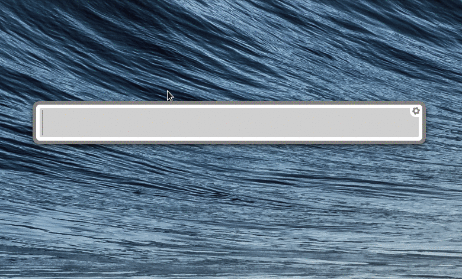
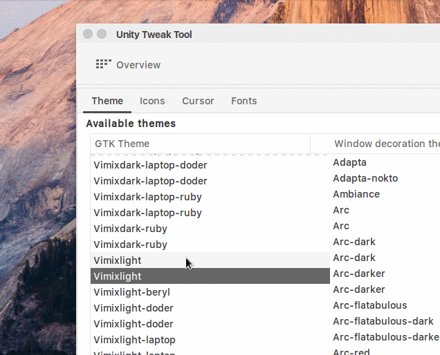

# Perfect Open Source Dev Environment

Most awesome hand-picked tools, apps, themes & tweaks.

|  |  |
| :---         |    ---:      |
|  |  |
|  |   |

Includes everything you need to start JS development right now and get pleasure during the process.

My Atom <a href="https://gist.github.com/andreystarkov/30d50ef6de9f37737618ab0c40267c38">sync-settings</a> config stores <a href="https://gist.github.com/andreystarkov/30d50ef6de9f37737618ab0c40267c38">here</a>.

<i>Tested on 16.10/16.04. Updated on 17.04 and its fine!</i>

### Usage:

```bash
  git clone https://github.com/andreystarkov/perfect-ubuntu
  cd ~/perfect-ubuntu
  chmod +x perfect-ubuntu.sh
  ./perfect-ubuntu.sh
```

#### TODO:

- Auto set theme (doesn't work now)
- Auto set other tweaks & settings
